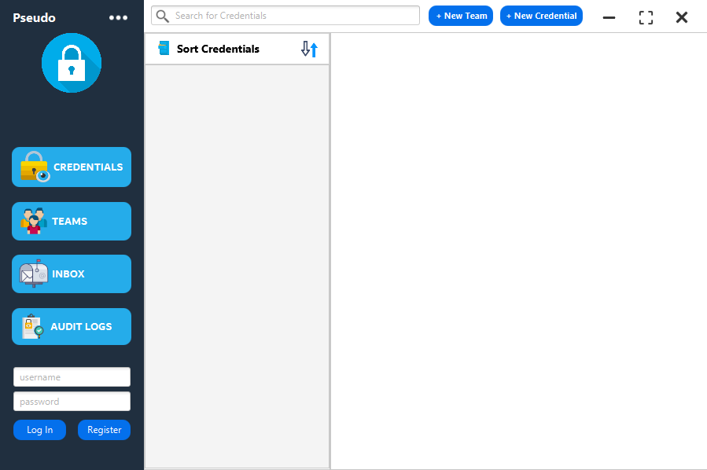
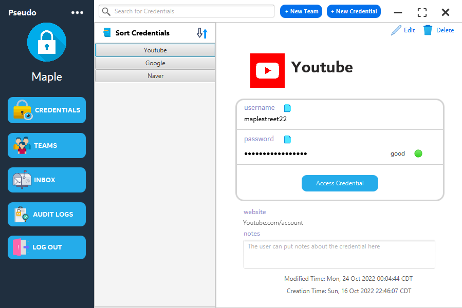
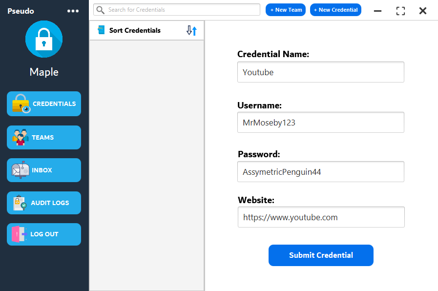
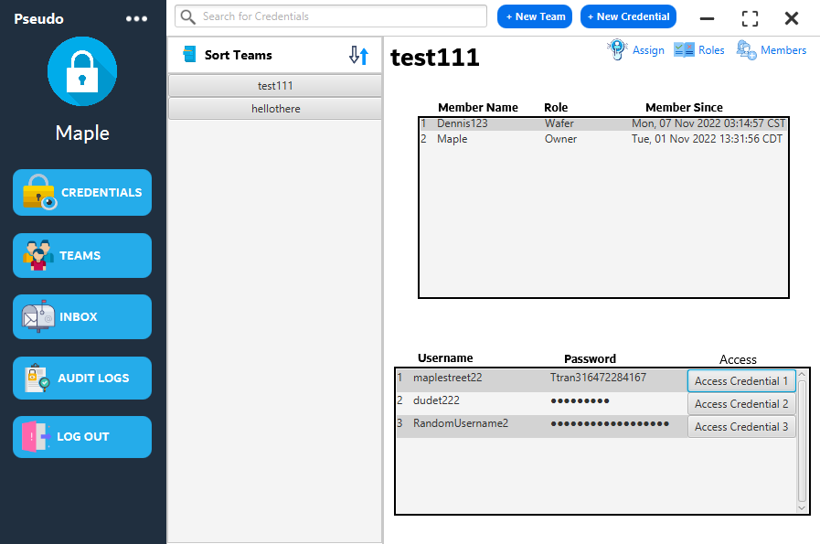
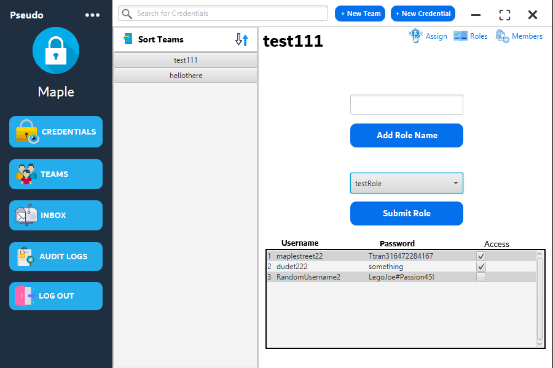
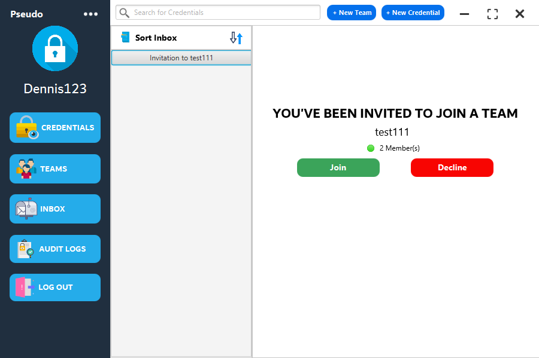
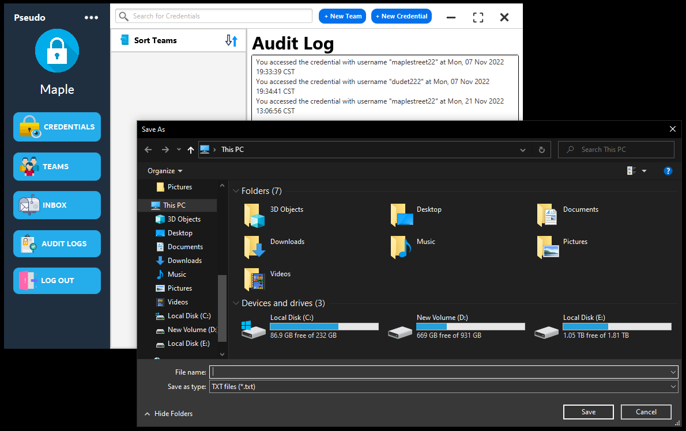

<p align="center">

</p>

# Authors

- [Brandon Pearson](https://github.com/blpearson26) - Cyber Security
- [Dennis Tran](https://github.com/DennisTran00)    - Computer Science
- [Addison Burkett](https://github.com/westvalard)  - Cyber Security
- [Kyle Parker](https://github.com/CraftyAmigo)     - Software Design & Development

# Background
The purpose of this product is to provide individuals, teams, and organizations with an easy-to-use, secure credential sharing solution. There are two main focuses for the Password Manager. 
* First, it will eliminate the hassle and security lapses of having to memorize/maintain passwords with a centralized vault for user credential storage and access. 
* Secondly, it will provide credential sharing ability with real-time alerts on credential access. 

With the Password Manager, users will be able to set up hierarchical systems in which specific users can be granted access to resources and credentials. When administrators change credential information, the software will automatically update passwords of any resources that are shared to other members. Additionally, administrators get privileged access to audit logs which display a record of credential access from all members.

Project Submission Structure
============================
> Folder structure has been split into detailed section for ease of understanding

### Top-level directory

    .
    ├── PassMnger                 # Project files
    ├── images                    # image files for the README.md
    ├── .gitignore
    └── README.md
    
### Source files
    .
    ├── PassMnger
    │   ├── src
    │   │   ├── main
    │   │   │   ├── java
    │   │   │   │   ├── Main          # Package that contains the launch application and GUI file
    │   │   │   │   ├── credential    # Package for credential isntances used to save user credentials
    │   │   │   │   ├── database      # Contains the database connection class for database access
    │   │   │   │   ├── gui           # Package for the GUI controller class
    │   │   │   │   ├── invites       # Package for invitation instances to add users to a team (feature)
    │   │   │   │   ├── role          # Package for creating role instances for team credential privileges 
    │   │   │   │   ├── team          # Package for team instances and storing information about created teams
    │   │   │   │   └── user          # Package for user isntances when a user registers an account
    │   │   │   └── ... 
    │   │   └── test 
    │   │   │   └── # test files
    │   └── ... 
    └── ...

<details><summary><b>Package Details</b></summary>

#### Main
    .
    ├── Main
    │   ├── PasswordManager.java        # The main launch application (creates the JavaFX Stage)
    │   ├── PasswordManagerGUI.fxml     # FXML file exported from SceneBuilder GUI creator
    │   └── Style.css                   # CSS file that formats fxml elements in the GUI
    
 #### credential
    .
    ├── credential
    │   ├── Credential.java             # Stores information about user added credentials
    │   └── CredentialInterface.java    # Methods for defining the behavior of Credential
    
 #### database
    .
    ├── database
    │   ├── DBConnection.java		# Creates a connection to the database and has querying methods
    │   ├── AESCipher.java		# Retrieves the keystore key and encrypts/decrypts credentials
    │   ├── KeyEncoding.java		# Enum class to define encoding methods
    │   ├── KeystoreUtil.java		# Setup for the keystore
    │   └── aes-keystore.jck		# The actual keystore which would usually be in secure location

 #### gui
    .
    ├── gui
    │   ├── InfoList.java                     # Updates the thumbnail list in the GUI
    │   └── PasswordManagerController.java    # Controller class that is linked to the FXML file
 
 #### invites
    .
    ├── invites
    │   ├── Invite.java                 # Stores information about team invitiations sent to other users
    │   └── InviteInterface.java        # Methods for defining the behavior of Invite
    
  #### role
    .
    ├── role
    │   ├── Role.java                   # Stores information about team role privileges
    │   └── RoleInterface.java          # Methods for defining the behavior of Role
 
   #### team
    .
    ├── team
    │   ├── Team.java                   # Stores information about a user created team
    │   └── TeamInterface.java          # Methods for defining the behavior of Team
    
   #### user
    .
    ├── user
    │   ├── User.java                   # Stores information about every user that registers
    │   └── UserInterface.java          # Methods for defining the behavior of User
 
 ### Resource Icons
 > Icons used in the Graphical User Interface can be found in the `res` pacakge by following the path: src > main > java > res.
 </details>
 
Screenshots
============================
<details><summary><b>Initial Startup</b></summary> 
<p align="center">

</p>
</details>

<details><summary><b>Credential View</b></summary>
<p align="center">

</p>
<p align="center">

</p>
</details>

<details><summary><b>Team View</b></summary>
<p align="center">

</p>
<p align="center">

</p>
</details>

<details><summary><b>Inbox with team invitiation</b></summary>
<p align="center">

</p>
</details>

<details><summary><b>Audit Log</b></summary>
<p align="center">

</p>
<p align="center">

</p>
</details>

Database
============================
This project currently utilizes a local MySQL database for demonstration purposes. Therefore, it is necessary to correctly set up the database before the software can be launched. The database connection is established by the following code within DBConnection.java:
````
    private DBConnection() {
		uri = "jdbc:mysql://localhost/passwordmanager?useSSL=false&allowPublicKeyRetrieval=true";
		try {
			dbCon = DriverManager.getConnection(uri, "root", "password");
		} catch (SQLException e) {
			e.printStackTrace();
		}
	}
````
This means that the MySQL account must have a username of `root` and a password of `password` to get the database working correctly. If the database is being establish on Windows OS, ensure that the MySQL service is running by pressing `Win + R` on your keyboard to open the Run window. Then type `services.msc` and hit enter. Scroll down until you see MySQL and run the service if it not doing so already.
Once MySQL is running on your machine, launch the MySQL command line. The following commands will set up the database required for the software to work:

<details><summary><b>Database Setup Commands</b></summary> 

````
CREATE DATABASE passwordmanager;

use passwordmanager;

CREATE TABLE user_info (
username VARCHAR(255),
password VARCHAR(255),
ID VARCHAR(255)
);

CREATE TABLE credentials (
UserID VARCHAR(255),
Username VARCHAR(255),
Password VARCHAR(255),
URL VARCHAR(255),
Notes VARCHAR(255),
Created VARCHAR(255),
CreationDate VARCHAR(255),
ModifiedDate VARCHAR(255),
Title VARCHAR(255)
);

CREATE TABLE teams (
GroupID VARCHAR(255),
GroupName VARCHAR(255),
OwnerID VARCHAR(255)
);

CREATE TABLE members (
GroupID VARCHAR(255),
Username VARCHAR(255),
UserID VARCHAR(255),
Role VARCHAR(255),
GroupName VARCHAR(255),
Joined VARCHAR(255)
);

CREATE TABLE roles (
GroupID VARCHAR(255),
RoleID VARCHAR(255),
RoleName VARCHAR(255),
Username VARCHAR(255),
Password VARCHAR(255)
);

CREATE TABLE invites (
GroupID VARCHAR(255),
UserID VARCHAR(255),
Username VARCHAR(255)
);

CREATE TABLE audit (
GroupID varchar(255),
Username VARCHAR(255),
CredentialUN varchar(255).
AccessTime VARCHAR(255)
);
````
</details>

Encryption
============================
This project utilizes AES symmetric encryption to secure the credentials that are stored in the database. Therefore, it is imperative that the setup for the encyption is done correctly. Not setting up the encryption for the project will result in several project runtime errors. Fortunately, this process is fairly simple. The Password Manager utilizes a Keystore that manages the keys used for encryption. To set up the Keystore follow these steps:
1. Assuming you are on Windows OS, open the Command Prompt by pressing `Win + R` and entering `cmd`.
2. Go into the database directory of the project. For example, doing `cd C:\Users\YOUR_USER\git\Pseudo\PassMngr\src\main\java\database` will change directories to the database directory. Not being in the correct directory will most likely cause errors to occur, thus this step is very important.
3. Once in the database directory, paste the following into the command prompt: `keytool -genseckey -keystore aes-keystore.jck -storetype jceks -storepass mystorepass -keyalg AES -keysize 256 -alias jceksaes -keypass mykeypass`. If the cmd prompt asks for a password, enter `password`. It most likely will not. Doing this step will create the Keystore file inside of the database directory that will be used. Ensure that the file is there by refreshing the project workspace in the Eclipse IDE.
4. Done! The Keystore should work now.

Testing Framework
============================
JUnit was used as the testing framework for this project. It is highly recommended that you use Eclipse IDE to run the project. The JUnit tests can be found under the `test` directory within `src`. To ensure that the tests work and that there are no compiling errors, make sure that you have the JUnit Library/Dependencies for the project. If you do not, follow these steps (in Eclipse IDE):
1. Right click the project file `PassMngr`.
2. Find and hover over `Build Path`, then click `Configure Build Path...`.
3. In the window that pops up, find and click on the `Libraries` tab.
4. Click on `ModulePath` and click `Add Library...`.
5. Select `JUnit` to add the library. The version should be JUnit 5. Click Finish.
6. JUnit should be imported as a library now. You can make sure of this by looking at the project files and see that JUnit is now in the project workspace.

Troubleshooting Problems
============================
> Since this project uses JavaFX for the graphical user interface, some problems related to JavaFX dependencies may occur when trying to launch the project for the first time. Make sure to follow these fixes to common problems with our project. All of these fixes are through the assumption that the project is being imported into Eclipse IDE.

<details><summary><b>Ensure that the correct JavaSE version is being used</b></summary>
	
Make sure that the correct JavaSE version is being utilized. To do this, expand the project directory in the workspace. 
Once the project directory has been expanded, you should see `JRE System Library`. 
Right click on it and proceed to `Properties`. A new window will open with the title `Properties for JRE Systerm Library`. 
Here you can change the version by checking `Execution Environment` and change it to `JavaSE-11 (jre)` if it is not so already
	
</details>

<details><summary><b>Installing the correct Java dependencies and setting it in the runtime configurations</b></summary>

If you run the project it will compile but you will get this error:

```` diff
- Error: JavaFX runtime components are missing, and are required to run this application

````
This error is shown since the Java 17 launcher checks if the main class extends javafx.application.Application. If that is the case, it is required to have the javafx.graphics module on the module-path.

A possible fix to many problems regarding JavaFX would be to use the JavaFX SDK instead of a build tool. Use this [link](https://gluonhq.com/products/javafx/) to download the correct JavaFX SDK. Our project uses javafx-sdk-17.0.0.1. Download the zip file and save it to a location on your drive.

Now, locate PasswordManager.java and right click it. Hover over `Run As` and select `Run Configurations...`. A new window titled `Run Configurations` should pop up. Navigate to the tab that says `Arguments` and under `VM arguments` add these VM arguments:

````

--module-path /path/to/javafx-sdk-17/lib --add-modules javafx.controls,javafx.fxml

````

</details>

<details><summary><b>Refreshing the workspace</b></summary>

If you are able to launch the project, but the GUI is just showing a white box, it means that is not correctly reading the .fxml file. Locate PasswordManagerGUI.fxml and make sure there is content in that file. If there is content in that file, make sure to refresh the workspace and relaunch the project. In most cases this will fix the problem of an empty GUI.

</details>

<details><summary><b>Program launches but program fails when trying to log in / register</b></summary>

If the project launches correctly and you are able to see the GUI, but unable to interact with the GUI (initial register and log in), then that means that the database is not set up correctly. This project heavily relies on a working database connection. Ensure to follow the instructions under the `Database` section to correctly set up the database.

</details>
